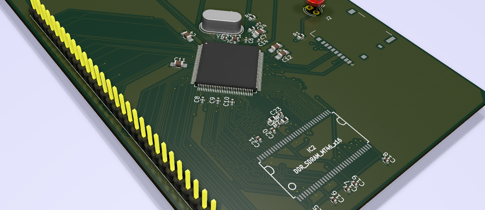
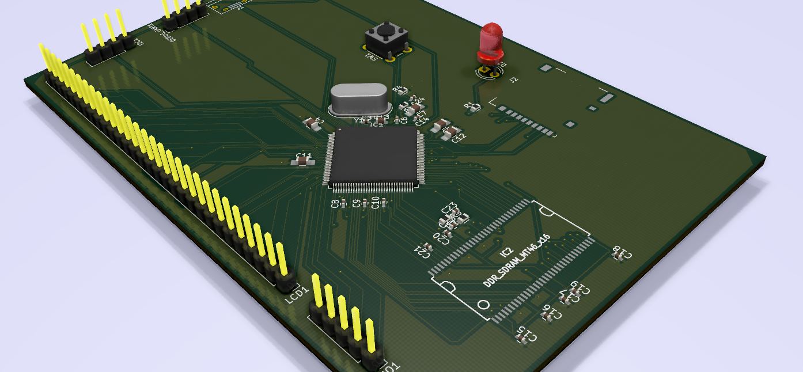

# Let me see if I can build a linux Computer

I am starting to build a single board computer with freescale microprocessor iMX233 128 LQFP and 64MB DDR2 SDRAM in 66TSOP. This single board computer will be bare bones with lots of GPIO exposed.
There is no special goal for this project. I am just curious to see if it works. In future I might add an LCD.

## TOODs
* Increase pad lengths of LQFP footprint. (done. Hope to mitigate the soldermask between pads issue  |<-0.06mm space-><-0.08mm web-><-0.06mm space->|  = 0.2mm) 
* Perhaps add a jumper on the 2.5v LineReg and separate out VDD_MEM to be able to test the 2.5v is not 0 due to loading. (skipped)
* 88 USB_ID SSP1_DETECT ? Should I use this to CD of SD card connector or micro USB ID pin?  In my circuit it is pulled low via LED. Tux,calculator does the same too.
* Add option to boot resistors LCD_RS and LCD_00..LCD_05 (done)
* 14 LCD_RS ? High for register boot mode. Or low with 47k resistor for OTP boot mode. Olimex is confusing OTP is set MMBR and LCD_RS is high. (done)
* Is Micro SD pullups on all pins necessary? SSP1_DETECT used?
* Schottkey Diode D1 VDD4P2 direction. Its strange in ref diagram vs 5v wall. VDD4P2 -|>||- VDDBATT. (done Optional)
* Series resistor 1E for preventing oscillations
/in old circuit Test by removing Diode, and LED_RS to gnd via resistor.
* RESET circuit? Make sure not to get into USB recovery mode. add zener 1.0v so that it never reached 3.3v or just remove reset circuit altogether.
* POWER off circuit? 
* Configure to get rid of batteries as per rev-c circuit. Add 1k resistors in DCDC_BATT and BATT and some caps to GND.
* Need to convert the SD card connector to a cheaper version available on ebay or alibaba. (done part-ATTEND 112J-TDAR-R01)
I got the files from https://forum.kicad.info/t/microsd-component-footprint-help/3095/5 and placed in parts/ folder. 
It would be awesome if I can find some 3D model of it. If someone finds it please create an issue. (Yes found)

### Length Tuning
* D0..D7 LDQS LDM - 39.7mm tuning (real 40.2mm)
* CLK nCLK - real 32.2/32.6mm
* D8..D15 UDQS UDM - 25.5mm tuning (real 26.0mm)
* Address: 32.35mm ~ 25mm
* CKE- 20.2mm
* SD: 24.8mm tuning (real 25.3mm)

## Installation steps
Cloning this repository should work.
It does use opendous
conn_fci from https://github.com/cpavlina/kicad-pcblib.git, https://github.com/cpavlina/kicad-schlib.git
Copy kicad-pcblib\conn-fci.pretty to  KiCad\share\kicad\modules\conn-fci.pretty
Add kicad-schlib-master\library\conn-fci.lib  to SchematicEditor -> ComponentLibraries
Add opendous to component libraries too.

## Drivers for this project.
* Until recently I didn't know of a decent opensource software for PCB designing or circuit designing which can be used to design complicated circuits involving microprocessor.
I recently discovered KiCAD which is opensource pcb designing software and people have done microprocessor design with it eg. OLinuXino. I am trying to learn PCB designing using KiCAD now.
* Second driver was Clementine Core project which I saw in circuitmaker website. This schematic looked so simple and pcb was on 2 layer design, which changed my thought process altogether that linux running board designs may be something I can try.
* Third driver was LibreCalc which almost proved that KiCAD can be used to design IMX233 based board. I hope to learn from their mistakes, but a newbee like me can uncover a whole lot of new mystries.

So I have put together a mashup of schematic design of IMX233 and 64MB RAM from freescale reference design and other sources. 

**Freescale microprocessor:**
* MCIMX233CAG4C

**DDR RAM - I think all these below RAM chips are compatible.**
* AS4C32M16MD1-5TCN
* HY5DU121622D(L)T(P)-J
* MT46V32M16P-5B:J (This is the only one I can source, so I am using this)

This project is a work in progress and there is no gurantee that I will ever be able to complete it :).

But if you want to try building same stuff as I am building. Go ahead and fork it.
Download KiCad. I am using nightly version of it, because it does not require you to export the netlist and import it again in pcb editor. Make the workflow really easy.
I can see one bug in KiCAD, which is after modifying the footprint by adding a step file. It looses the saved settings. 

Once you have installed KiCAD, open **MyIMX233.pro** file. 

[MyIMX233.sch](MyIMX233.sch) - Schematic file.

[MyIMX233.kicad_pcb](MyIMX233.kicad_pcb) - PCB

[ReferenceSch](ReferenceSch) - contains reference materials. I uploaded all of them for providing content incase someone wants to understand the design.

## Progress: 

* I also ordered components. I didn't realize this would be a pain. element14 is not that accessible for an individual. I ordered mostly from Shelfkey and some from KitsNSpares. I am still tensed if footprints I chose will match the actual components. Second I am very much tensed about soldering 0402 components.
* Final version of PCB sent for fab in pcbpower. 

* Added few options to use DCDC. I was not comfortable of grounding DCDC_BATT and BATT pins, so I added a few jumpers. Also added provisions to add battery. 

* Learnt basic Freecad to build the Step files of DDR SDRAM 66TSOP. Here is the project I created - [MT46V32M16P-5B-Freecad-Step](https://github.com/samarjit/MT46V32M16P-5B-Freecad-Step).

* Initial version. DDR RAM child 3D missing and SD card's 3D missing.

* Learnt Length Matching in Kicad. 

* Figured out placement of components. I am going with Clementine Core's placement which seems very good. 

